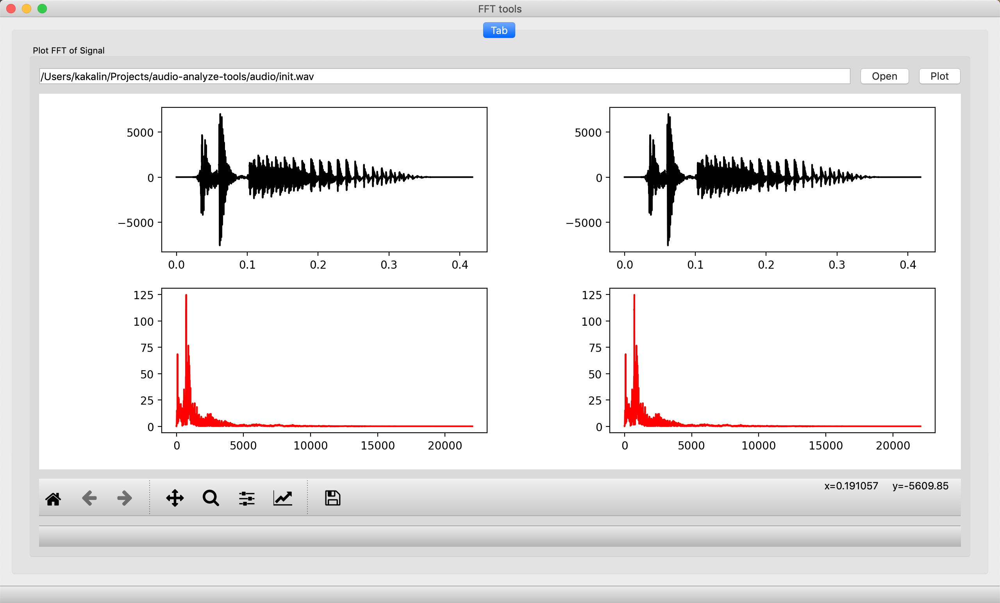

# Audio Tools

1. Audio Analysis
    - [Fast Fourier Transform](https://en.wikipedia.org/wiki/Fast_Fourier_transform)

## Require

```bash
$ pip3 install -r requirements.txt
```

## Usage

```bash
$ python3 audio_analyze_tools.py
```

## Example


